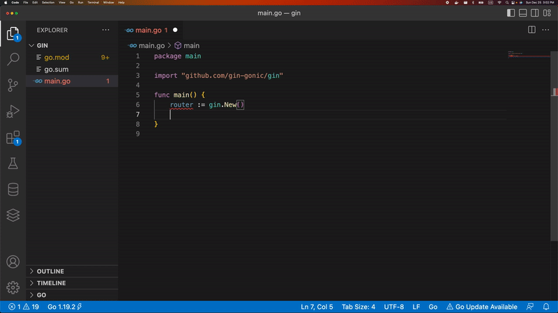

# gin-snippets README

This extension holds snippets to build web applications using gin framework in Go.

## Usage

You can install the extension from vscode marketplace or from here [Gin Framework Snippets](https://marketplace.visualstudio.com/items?itemName=Dhikilabs.gin-snippets). Once the extension has been installed, you can start typing in any `go` file and after `gin-` it should list out all the available snippets.

## Currently available snippets snippets

Following are the list of all available snippets.

| Prefix (name)                                 | Snippet result                                          |
|-----------------------------------------------|---------------------------------------------------------|
gin-app
| `gin-app`                  | Create simple app in Gin. 
| `gin-router`                  | New Gin router snippet. 
| `gin-handle-method-not-allowed-snippet`                  | Check methods not allowed snippet 
| `gin-handle-route-not-implemented-snippet`                  | Check routes not implemented snippet.  
| `gin-routes-snippet`                  | Register new routes snippet
| `gin-router-group-snippet`                  | New routes group in gin |
| `gin-run`                  | Run server |
| `gin-handler`                  | Gin handler function.                             |
| `gin-handler-post`           | Gin handler function to handle POST request.                    |
| `gin-middleware-generic`            | Generic gin middleware use template.                       |
| `gin-middleware-use`            | Generic gin middleware function.                       |
| `gin-middleware-logger-json`             | Gin middleware to log to JSON.                |
| `gin-middleware-basic-auth`      | Gin middleware for basic auth ( username / password ).       |
| `gin-middleware-cors`       | Gin middleware to handle CORS.          |
| `gin-response`       | JSON HTTP response in Gin.          |
| `gin-load-config`       | Load config template from config.yaml file.          |
| `gin-query-params-snippet`       | Gin query params snippet          |
| `gin-header-set`       | Set headers         |

## Contributions

Please feel free to raise a PR and contribute. Contributions are always welcomed.
